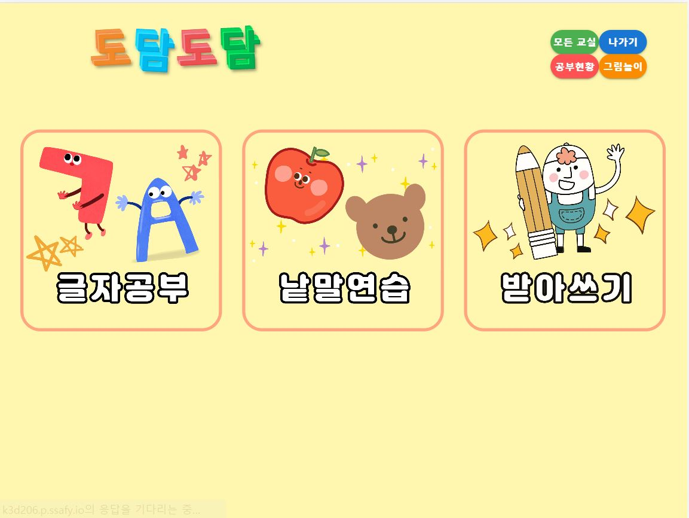
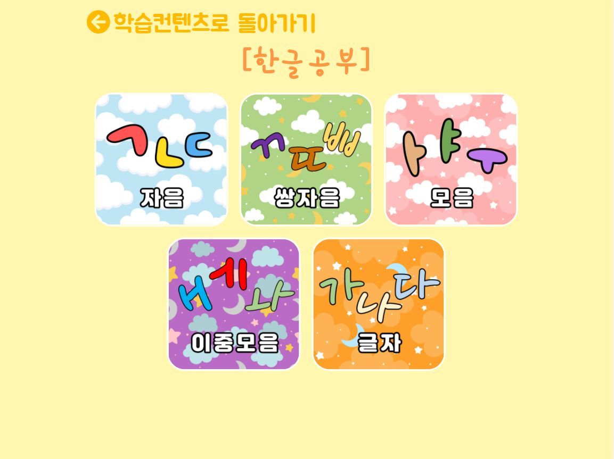
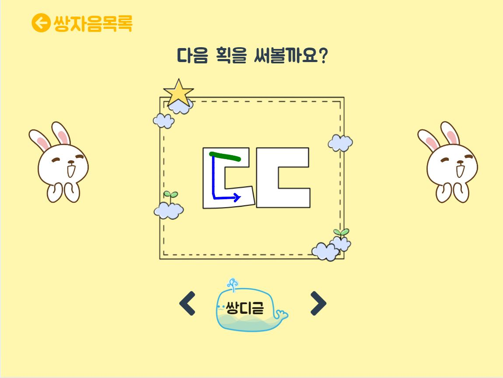
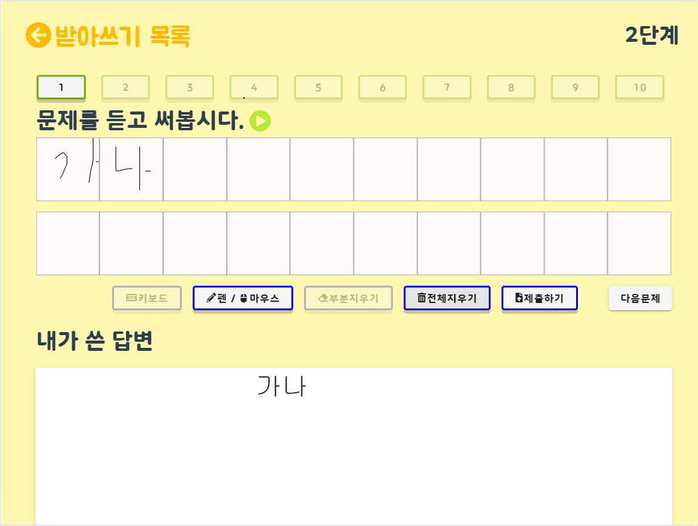
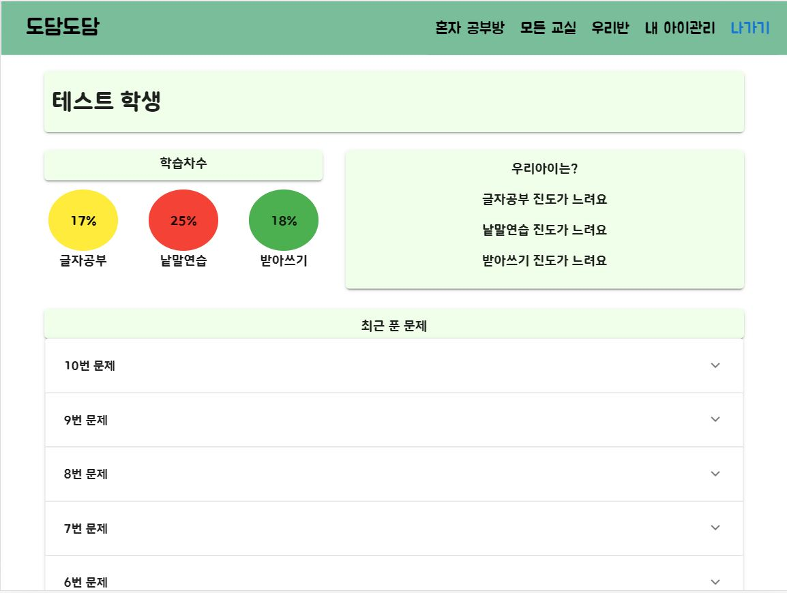
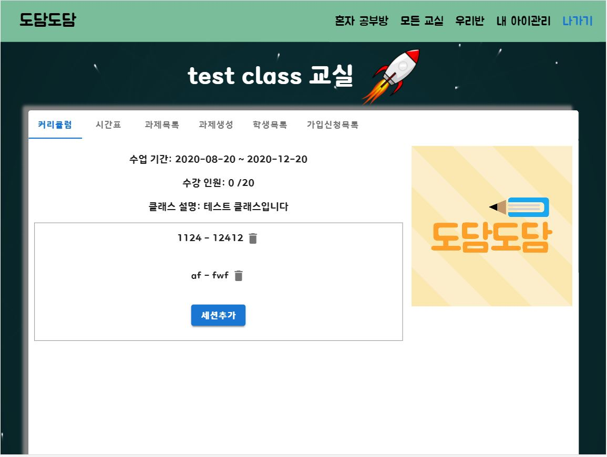
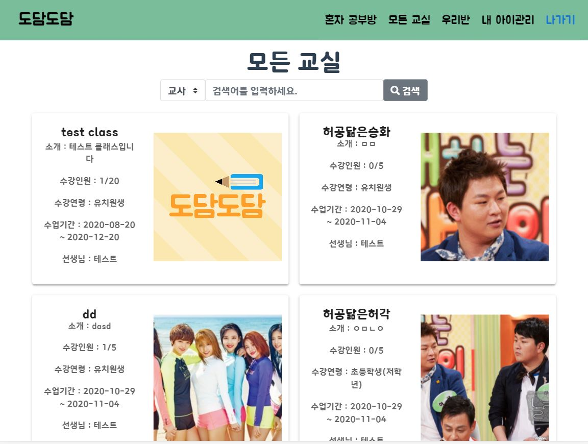

# 프로젝트명 -도담도담

#### 개요
도담도담 - 유아 교육용 플렛폼
언텍트 시대에 부합하는 유아 교육용 플랫폼을 만드는 것을 목표로 함, 기존 교육 플랫폼과의 차별점으로 OCR과 TTS를 이용한 편의 사항과 클래스 기능을 이용하여 선생과 학생을 연결시키는 기능을 제공함.

#### **팀명 : 벙글이들**

팀장 : 백정훈

팀원 : 박지은, 이원우, 이용수, 진승화

#### 역할

|        | Backend | Frontend | AI적용 | Git  | UCC  | PPT  | 배포 |
| ------ | ------- | -------- | ------ | ---- | ---- | ---- | ---- |
| 백정훈 | √       | √        |        |      |      |      |      |
| 박지은 |         | √        |        |      | √    | √    |      |
| 이원우 | √       |          | √      | √    |      |      |      |
| 이용수 | √       |          | √      |      |      |      | √    |
| 진승화 |         | √        |        | √    |      |      |      |

## 기술 스택

    - vue 2.6.12
    - Spring boot 2.3.1
    - mysql 5.7.32
    - Ubuntu 18.04.1
    - Google auto draw

## Main Page

---

## 글자공부

  - ㄱ, ㄴ, ㄷ, ㅏ,ㄲ와 같은 학습할 글자를 선택하는 페이지

## 글자쓰기

  - ㄱ, ㄴ, ㄷ, ㅏ,ㄲ와 같은 학습할 글자를 획순에 맞게 학습하는 페이지

## 받아쓰기

  - 미리 등록된 음성 혹은 tts를 이용하여 문제를 듣고 받아쓰는 페이지

## 학습현황

  - 학생의 학습 현황을 분석할 수 있는 페이지

## 클래스

 - 커리큘럼, 과제, 학생을 관리하는 클래스 페이지

## 클래스 조회

- 새로 등록하기 위한 클래스를 찾는 페이지

## 일정

### 1주차

- 기획

### 2주차

- 기획 확정  
- 기본 기능 개발
- 클래스 기능 개발

### 3주차

- 컨텐츠 기능 개발
  - 글자공부
    - FE 화면설계
    - 글자 구현 기능
  - 낱말연습
    - FE 화면설계
    - 그림 그리기 기능
  - 그림놀이
    - FE 화면설계
    - 그림 그리기 기능
  - 받아쓰기
    - FE 화면설계
    - 받아쓰기 기능
    - 말하기 기능
- 홈 화면
  - FE 디자인

### 4주차

- 컨텐츠 기능 개발 완료
  - 글자공부
    - 화면 + 기능 연동
    - 화면 디자인 CSS 적용
  - 낱말연습
    - 화면 + 기능 연동
    - 화면 디자인 CSS 적용
  - 그림놀이
    - 화면 + 기능 연동
    - 화면 디자인 CSS 적용
  - 받아쓰기
    - 화면 + 기능 연동
    - 화면 페이지 이동 적용
    - 화면 디자인 CSS 적용
- 클래스 회원관리 

### 5주차

- 프론트엔드 기능 개발 완료
  - 클래스
    - 과제 제출
    - 과제 조회
    - 커리큘럼
  - 그림 놀이
   - 화면 디자인 css 수정
  - 과제 제출
   - 받아쓰기 과제 제출
   - 낱말연습 과제 제출

### 6주차

### 7주차

### 팀원 리뷰(소감)

